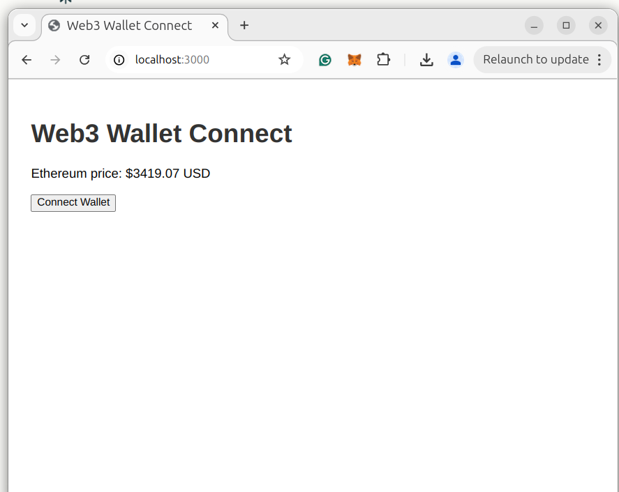

# Project Title

## Overview

This project is an Express.js application that uses EJS as the templating engine. Below are the steps to set up and run the application locally.

## Setup Instructions

1. **Rename HTML File:**

   - The `index.html` file has been renamed to `index.ejs` and moved to the `views` folder. All EJS templates should be placed in the `views` folder.

2. **Install Dependencies:**

   - Install the required npm modules by running:
     ```bash
     npm install
     ```

3. **Run the Application:**

   - Start the application using:
     ```bash
     npm start
     ```
   - The app will run on port **3000**. Open your browser and navigate to:
     ```
     http://localhost:3000/
     ```

4. **Final User Interface:**

   - Below is a preview of the final user interface you will see on your screen:

   

## Additional Information

- Ensure that you have Node.js installed on your machine before running the application.
- If you encounter any issues, please check the console for error messages.

## License

This project is licensed under the MIT License - see the [LICENSE](LICENSE) file for details.
